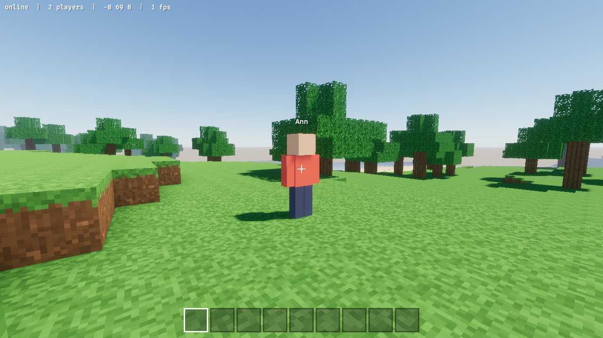

# Bloxy

A browser-first multiplayer voxel sandbox in Bevy, heading toward the feel of big modded block-building packs: machines, power and automation (later). A procedural ocean of islands: hilly meadows, forests of oak, birch, spruce or palm, central mountains with snowy peaks, giant mushrooms, volcanoes with lava, frozen islands in drifting ice, sandy cays; caves and ore veins (coal, copper, tin, iron, gold, diamond). Every island has a named, unbreakable waystone: stand by one to remember the island, right-click any waystone to travel to an island you remember; mining and building; other players over WebSockets; accounts with painted pixel skins. No mesh or texture assets: everything is generated.

Play in the browser: https://peachpearorange.github.io/bloxy/ (needs WebGPU: a recent Chrome or Edge).

- Play solo: `cargo run` (or open the web build).
- Run a server: `BLOXY='{serve: 7777}' cargo run`.
- Join: `BLOXY='{connect: "ws://host:7777", name: "Ann", password: "…"}' cargo run`, or in the browser `?connect=wss://host` (browsers on https need `wss://`, e.g. behind Caddy).

Controls: click to capture the mouse, WASD, Space jump/swim, Ctrl sprint, hold left mouse to dig, right mouse to place, 1–9 or the wheel for the hotbar. Tab or Esc opens the menu: waystones, settings (view distance, mouse sensitivity, field of view, invert mouse), your profile (name and password; the browser remembers them, and a generated password can be copied to keep elsewhere) and the skin editor. Add `creative: true` to the opts for a hotbar of building blocks.
